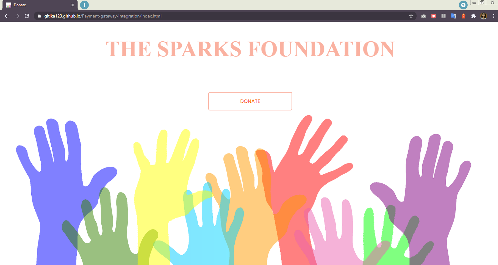
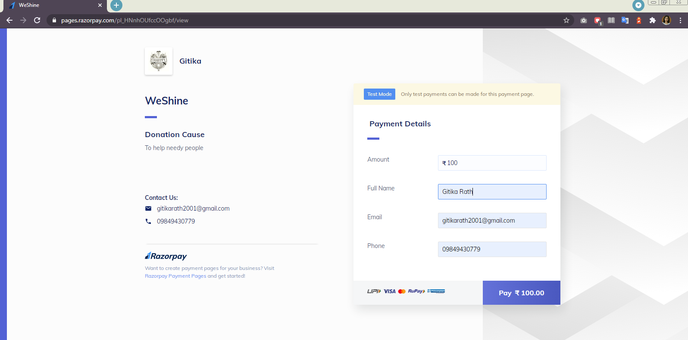
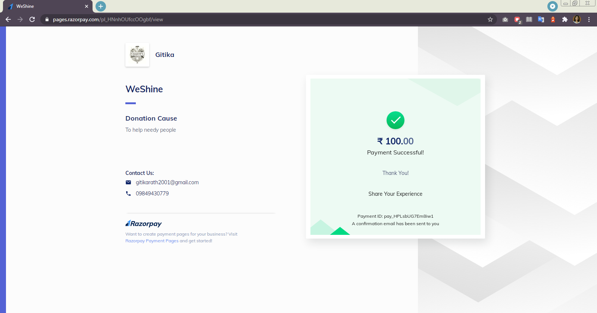

# Payment-gateway-integration
# Task
Payment Gateway Integration - https://gitika123.github.io/Payment-gateway-integration/index.html
## About
Created a simple website where payment gateway is integrated. There is a simple donate button on homepage, on clicking the donate button, the user will land on the payment page where user can select the amount to be paid and the payment type like Credit Card, Netbanking, Paypal and Debit Card. On successful payment an invoice will be generated and email will be sent to the user for payment received .
## Screenshots
 
 

